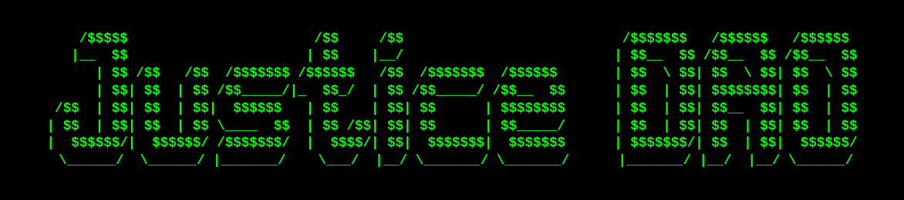
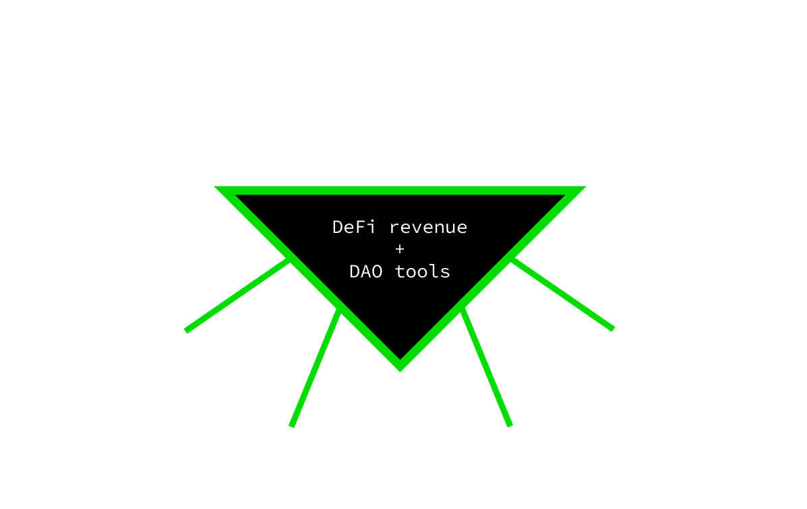

JusticeDAO scales justice-seeking movements to unprecedented levels through DAO tooling & perpetual DeFi revenue streams.

# Mission
Our mission is to accelerate the eradication of the world's most pressing issues; including climate change, refugee crisis, and countless forms of discrimination.

# How
- **JusticeDAO Factory:** A decentralized movement can't be stopped. Our DAOs use <a href="https://medium.com/giveth/conviction-voting-a-novel-continuous-decision-making-alternative-to-governance-aa746cfb9475">conviction voting</a> for effective self-organization that social movements need.
- **JusticeDAO Fund:** Never again will a social movement stall because of limited funds, our DeFi tools and investor network allow for sustainable financing until the last injustice has been eradicated.
- **International Justice Alliance:** A global alliance of prominent justice-seeking web3 pioneers, investors, researchers, and activists.

# Roadmap
- Q1: Launch of JusticeDAO and the $JUSTICE token through liquidity bootstrapping pool, creation of our International Ambassador Program and educational programs.
- Q2: Creation of the JusticeDAO Factory and Grant Fund.
- Q3: Integrating as many oracle solutions to bring off-chain data onchain to allow for social movements to better use DeFi in their daily activities.
- Q4: Creating web2-web3 DAO bridges to make DAOs as seamless of an experience as possible for even the non-literate.

 **We believe there's a place for everyone in the pursuit of Justice...** 
